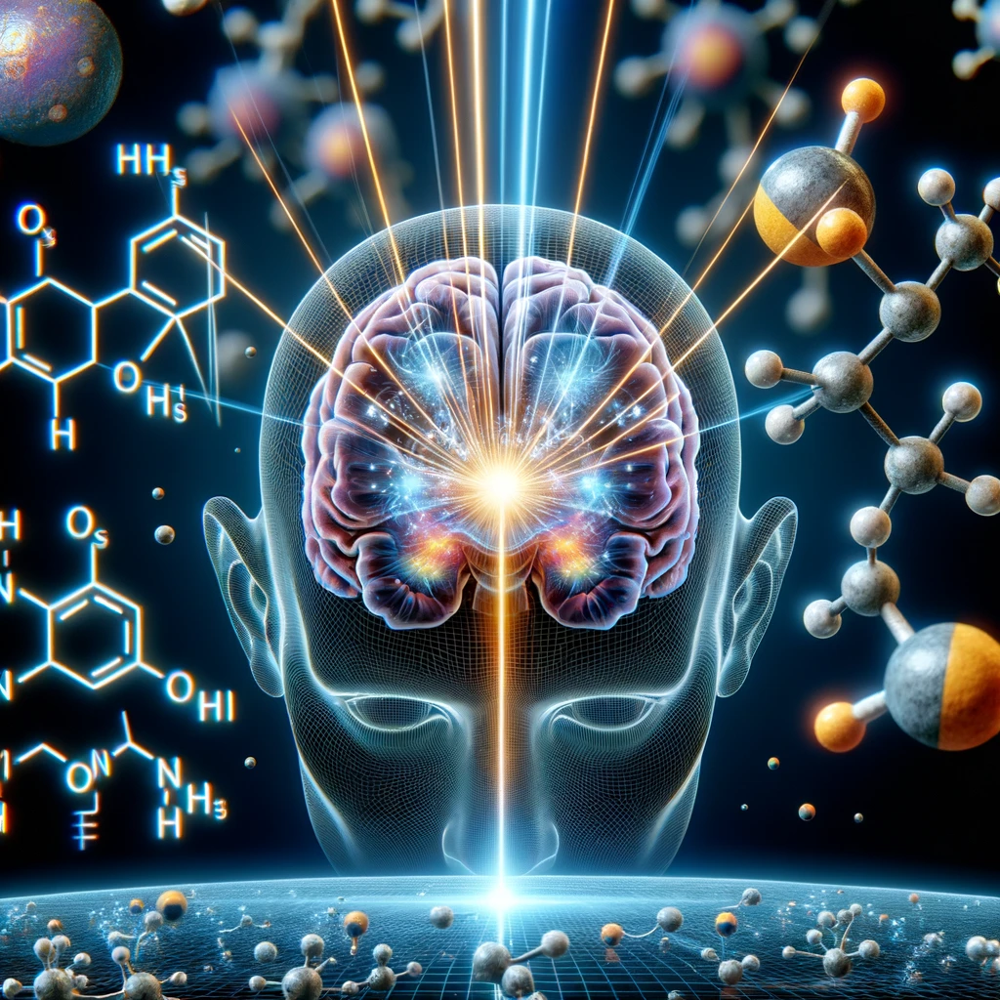
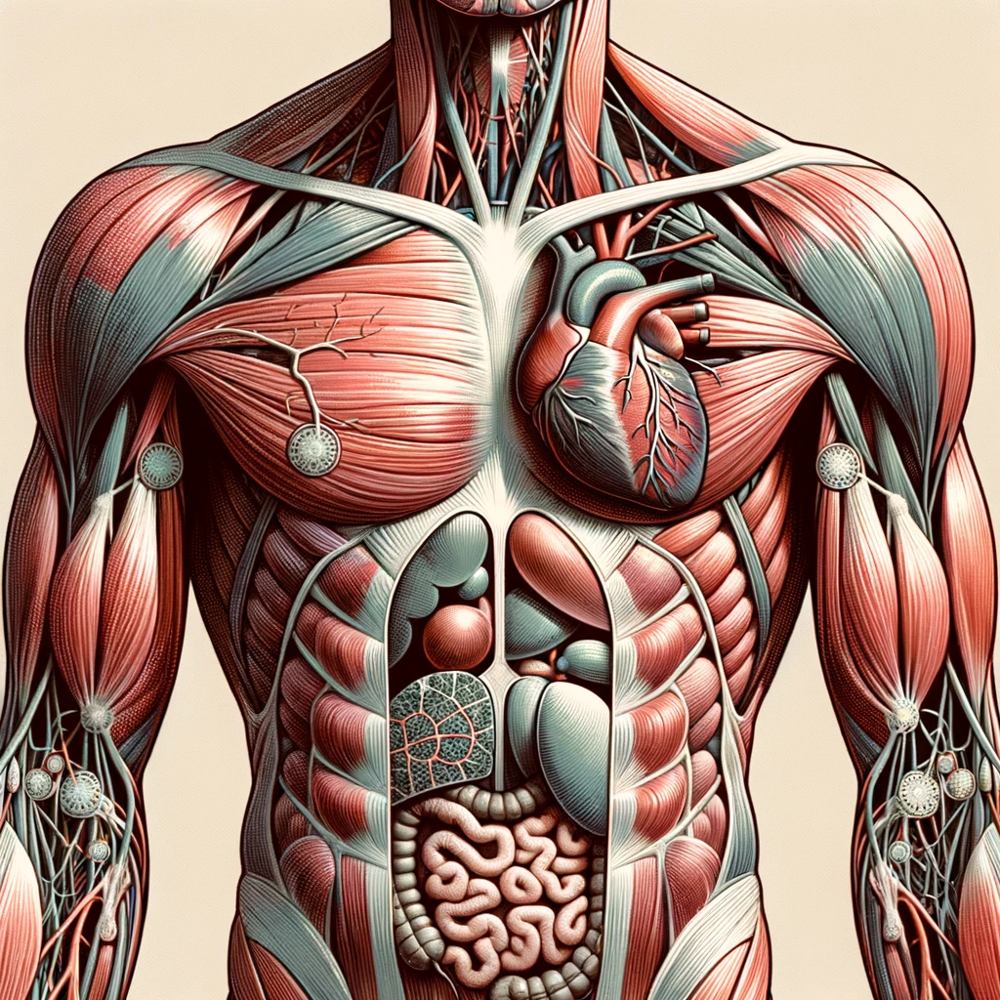
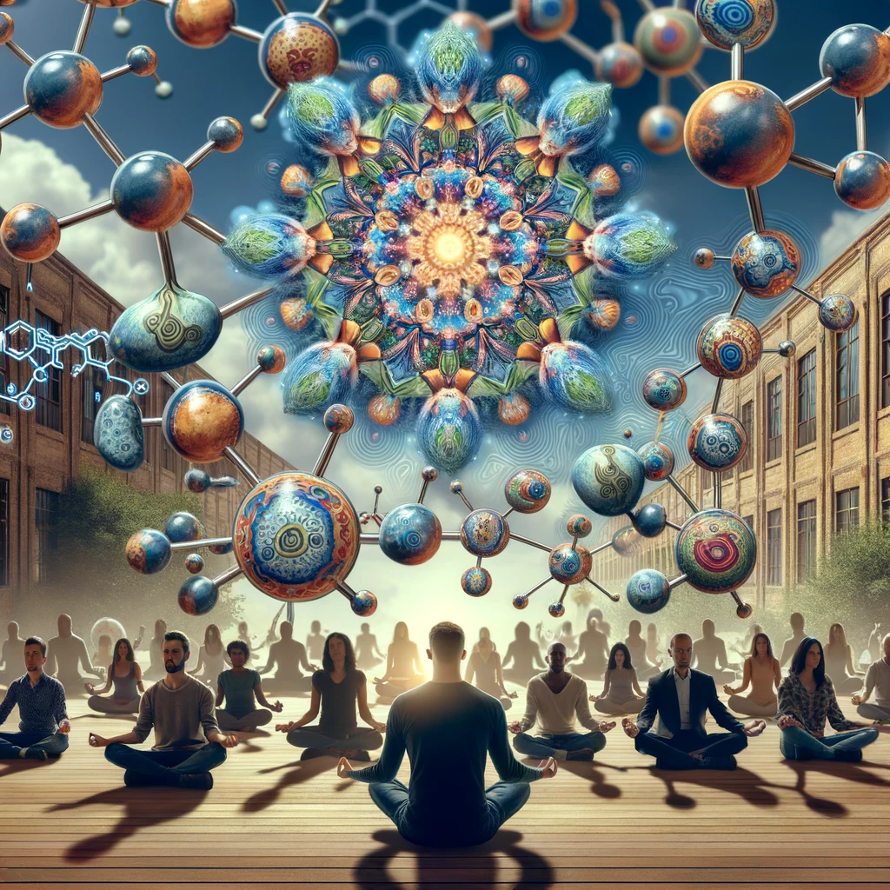

```
   1.Dna
        \
2.HAT -> 4.mRNA -> 5.Wide -> 6. Association 
        /
        3.E-box
```


1. Voir 👀,  Photons::SCN
   - Catabolic//HOMEOSTASIS
   - Biochemistry::Catecholamines
     
2. Savoir $+$, <a href="https://en.wikipedia.org/wiki/CLOCK#:~:text=CLOCK%20(from%20circadian%20locomotor%20output,and%20period%20of%20circadian%20rhythms">CLOCK-BMAL1</a>
   - ATP::Adenosine//ALLOSTASIS
   - Psychology::Nicotinic/Muscarinic
     
3. Pouvoir $-$, PER-TIM
   - Anabolic::Drowsy/SOCIOSTASIS
   - Sociology::Rituals::GABA
  
     ---

**The Foundational Triad of Human Experience: Voir, Savoir, and Pouvoir**

In the intricate dance of human existence, we often look for patterns, frameworks, or guiding principles to make sense of the world around us. One such comprehensive framework, dubbed "everything-in-a-nutshell," seeks to explain the foundational aspects of human existence through a triad of concepts: Voir, Savoir, and Pouvoir. These three pillars, although distinct, intertwine seamlessly, providing a unified perspective on the biological, psychological, and sociological facets of human life.

**1. Voir: The Biological Prism of Perception**



At the heart of "Voir" lies the mechanism of how we perceive the world. This pillar emphasizes the interaction between photons and the Suprachiasmatic Nucleus (SCN). Photons, the primary particles of light, play a pivotal role in our visual perception. They interact with the SCN, a part of our brain responsible for controlling our circadian rhythms, impacting our sleep-wake cycles and overall homeostasis.

In the realm of biochemistry, Voir centers around catecholamines, a group of neurotransmitters that include dopamine, norepinephrine, and epinephrine. These endogenous ligands bind to specific receptors, modulating our responses to stress and influencing our mood, attention, and overall catabolic homeostasis.

**2. Savoir: The Psychological Balance of Knowledge**



Savoir dives into the CLOCK-BMAL1 molecular mechanism, which forms the core of our biological clocks. This interaction plays a crucial role in regulating various physiological processes, from metabolism to behavior. The balance between ATP, the primary energy currency of cells, and its breakdown product, adenosine, underscores the principle of allostasis. As adenosine accumulates, it binds to its receptors, leading to feelings of drowsiness and promoting sleep.

On the psychological front, Savoir revolves around the interactions between nicotinic and muscarinic receptors. While the endogenous ligand acetylcholine binds to both, exogenous ligands such as nicotine (from tobacco) and muscarine (from certain mushrooms) can selectively activate these receptors. This selective activation has profound implications on cognition, memory, and arousal.

**3. Pouvoir: The Sociological Power of Rituals**
The final pillar, Pouvoir, brings forth the sociological perspective, emphasizing the role of PER-TIM interactions in controlling our biological clocks. This pillar juxtaposes anabolic processes, which build up our body's molecules, against the drowsy state of sociostasis, where societal norms and routines maintain stability.



At the heart of Pouvoir is the sociology of rituals. These shared, repetitive practices bind communities together, providing a sense of belonging and purpose. Biochemically, GABA (Gamma-Aminobutyric Acid), an inhibitory neurotransmitter, becomes the focal point. GABA regulates neuronal excitability, and its receptors are targeted by various substances, from endogenous ligands to common exogenous agents like alcohol and commercial medications such as benzodiazepines.

In conclusion, the "everything-in-a-nutshell" framework captures the essence of human existence by intertwining biological, psychological, and sociological perspectives. By understanding the foundational tokens of Voir, Savoir, and Pouvoir, we gain a holistic view of the human experience, from the microscopic interactions of molecules to the macroscopic rituals that bind societies together.


---

**CLOCK-BMAL1: A Deep Dive into the Master Regulators of the Circadian Rhythm**

The circadian rhythm, an innate biological clock that governs our sleep-wake cycle, mood, metabolism, and more, is a marvel of evolutionary biology. At the heart of this complex mechanism lies a duo of intertwined proteins, CLOCK (Circadian Locomotor Output Cycles Kaput) and BMAL1 (Brain and Muscle ARNT-Like 1). Together, these proteins form the core machinery that drives the circadian rhythm in mammals.

**Chemistry and Structure:**
CLOCK and BMAL1 are transcription factors, meaning they bind to specific sequences of DNA to regulate gene expression. They dimerize, or pair up, to form a complex that binds to specific DNA sequences called E-boxes. This binding initiates the transcription of several genes, most notably the period (PER) and cryptochrome (CRY) genes.

**Receptors and Pathways:**
Once transcribed and translated, the PER and CRY proteins form their own complexes that eventually inhibit the activity of the CLOCK-BMAL1 complex, creating a negative feedback loop. This feedback mechanism ensures the rhythmic expression of these genes, with roughly a 24-hour cycle. The intricate interplay between these proteins establishes the fundamental rhythm that other cellular processes then follow.

**Effects:**
The CLOCK-BMAL1 complex doesn't just regulate sleep. It influences a myriad of physiological processes:

1. **Metabolism:** The circadian rhythm plays a crucial role in glucose metabolism, lipid synthesis, and appetite regulation. Disruptions in this rhythm can lead to metabolic disorders.
2. **Hormone Secretion:** Hormones like cortisol and melatonin are released in a circadian pattern, affecting our alertness and sleep.
3. **Mood and Behavior:** Disturbances in the circadian rhythm have been linked to mood disorders like depression and bipolar disorder.

**Interactions:**
The circadian system is not isolated; it interacts with various other pathways and systems. For instance, light is a significant external cue (or zeitgeber) that resets our circadian clock. Photons from light interact with retinal cells in our eyes, which then signal the suprachiasmatic nucleus (SCN) in the brain — the central circadian pacemaker. The SCN, in turn, uses neurotransmitters to synchronize peripheral clocks throughout the body.

**Modulators:**
Several ligands can modulate the circadian rhythm:

1. **Endogenous Ligands:** Melatonin, produced by the pineal gland, is a natural hormone that signals nighttime and promotes sleep. 
2. **Exogenous Ligands:** Caffeine, found in coffee and tea, blocks adenosine receptors, leading to increased alertness and wakefulness. It indirectly affects the circadian rhythm by promoting wakefulness.
3. **Commercial Ligands:** Modern medicine has developed drugs like modafinil, used to treat narcolepsy, which can modulate the sleep-wake cycle. Additionally, synthetic melatonin supplements are used to treat circadian rhythm sleep disorders.

In conclusion, the CLOCK-BMAL1 complex is a fundamental component of the circadian machinery. Understanding its intricate workings and interactions with other systems provides insight into the broader physiological and behavioral patterns observed in humans. As research continues, there's hope for developing therapeutic strategies to treat circadian rhythm disorders and associated health conditions.
